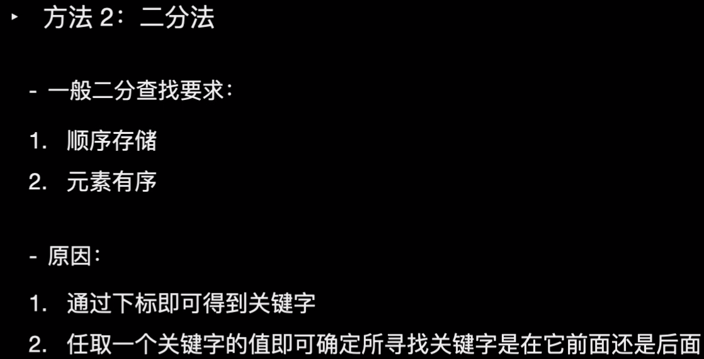

# 二分查找


## 旋转数组的二分查找
```java
    public static int minArray2(int[] numbers) {
        //暴力法与二分法相结合
        if(numbers == null || numbers.length == 0)
            return -1;
        int left = 0;
        int right = numbers.length - 1;
        int mid = 0;
        while(left < right) {
            mid = (left + right) / 2;
            //直接能够找到旋转数组所在
            if(numbers[mid] > numbers[right])
                left = mid + 1;
            else if(numbers[mid] < numbers[right])
                right = mid;
            else {
                right--;
            }
        }
        return numbers[left];
    }
```
