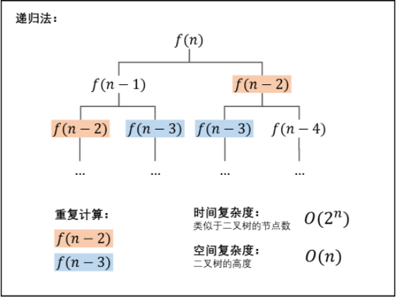

# 动态规划

## 动态规划与斐波那契数列

如果我们使用递归传方式来解决斐波那契数列的话:
```java
public static int fib(int n) {
    if(n == 0)
        return 0;
    if(n == 1)
        return 1;
    return fib(n - 1) + fib(n - 2);
}
```
可以从下面的图上看出这种方法的弊端:

从上面可以看出,有很多重复计算,为了解决这种情况,我们采用了动态递归的方法,关于动态递归:
```
动态规划（Dynamic Programming）与分治方法相似，都是通过组合子问题的解来求解原问题。不同的是，分治方法通常将问题划分为互不相交的子问题，递归地求解子问题，再讲它们的解组合起来，求出原问题的解。而动态规划应用于子问题重叠的情况，即不用的子问题具有公共的子子问题。在这种情况下，如果采用分治算法，则分治算法会做许多不必要的工作，它会反复地求解那些公共子子问题。对于动态规划法，它对每个子子问题只求解一次，将其保存在一个表格中，从而无需每次求解一个子子问题时都重新计算，避免了这种不必要的计算工作。
  也就是说，动态规划法与分治方法相比，是用空间来换时间，而时间上获得的效益是很客观的，这是一种典型的时空平衡（time-memory trade-off）的策略。
```
所以,我们采用从下往上求解的方法,先求解`f(0)`,再求解`f(1)`,并且把结果存储起来,当计算当前需要的结果的时候,就把前两项的结果加起来,下面是采用动态规划的方法来解决斐波那契数列:
```java
    public static int fib2(int n) {
        //并不需要一个很大的数组来求解当前项,我们只需要记录下当前项的前两项
        int pre1 = 0, pre2 = 1;
        //记录当前项的值
        int num = 0;
        if(n == 0)
            return 0;
        if(n == 1)
            return 1;
        for(int i = 2; i <= n; i++) {
            //开始刷新前两项的值
            num = (pre1 + pre2) % 1000000007;
            pre1 = pre2;
            pre2 = num % 1000000007;
        }
        return num;
    }
```
下面这道题是斐波那契数列的变体:
```
一只青蛙一次可以跳上1级台阶，也可以跳上2级台阶。求该青蛙跳上一个 n 级的台阶总共有多少种跳法。

答案需要取模 1e9+7（1000000007），如计算初始结果为：1000000008，请返回 1。
```